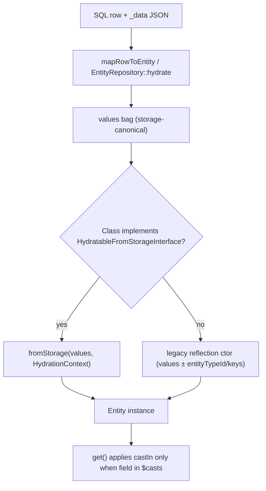
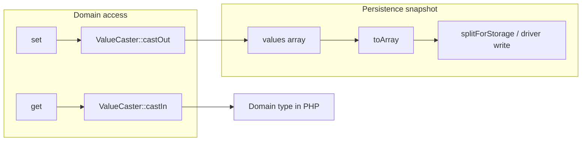

# Entity System

<!-- Spec reviewed 2026-04-08 - composer manifest policy normalization for packages/config, packages/entity-storage, packages/entity, packages/field; no entity runtime behavior change -->
<!-- Spec reviewed 2026-04-08b - restored packages/config symfony/event-dispatcher floor from ^7.3 back to ^7.0; no entity/config runtime behavior change -->
<!-- Spec reviewed 2026-04-09 - packages/entity and packages/entity-storage composer.json (manifest policy); storage and entity semantics unchanged -->
<!-- Spec reviewed 2026-04-09c - readMultiple/findMany, SqlEntityQuery request-scoped result cache + save/delete invalidation (milestone 45) -->
<!-- Spec reviewed 2026-04-09d - HydratableFromStorageInterface, HydrationContext, EntityInstantiator (#1188) -->
<!-- Spec reviewed 2026-04-09e - packages/entity Cast kernel (#1181 ST-1): ValueCaster, CastDefinition, CastException -->
<!-- Spec reviewed 2026-04-09f - EntityBase $casts + cast-aware get/set (#1181 ST-2); ContentEntityBase delegates to EntityBase -->
<!-- Spec reviewed 2026-04-09g - ST-4/ST-5 persistence: hydrate + toArray remain raw; integration tests in entity-storage -->
<!-- Spec reviewed 2026-04-09h - EntityValidator uses EntityInterface::get() for all entities (#1181 ST-6); cast-aware validation -->
<!-- Spec reviewed 2026-04-09i - packages/api ResourceSerializer attributes via get() + JSON normalization (#1181 ST-7) -->
<!-- Spec reviewed 2026-04-09j - EntityValues helper, presentation layers use cast-aware maps (#1181 ST-8) -->
<!-- Spec reviewed 2026-04-09 ST-9 - casting + hydration architecture finalization: diagrams, invariants, EntityValues/get/set/toArray/config rules (#1181) -->
<!-- Spec reviewed 2026-04-08g - symfony/* require ^7.0 on entity + entity-storage (#1151); no entity behavior change — symfony-version-floors.md -->

Subsystem specification for the Waaseyaa entity, entity-storage, field, and config packages. Covers entity interfaces, storage implementations, query building, field definitions, config entities, and lifecycle events.

## Public Surface

Authoritative dispositions are in `docs/public-surface-map.php`, verified by `PublicSurfaceVerificationTest`.

**Public API** (stable, semver-protected):

| Package | Interfaces/Classes |
|---------|-------------------|
| entity | `EntityInterface`, `EntityBase`, `ContentEntityBase`, `ContentEntityInterface`, `ConfigEntityBase`, `ConfigEntityInterface`, `EntityTypeInterface`, `EntityTypeManagerInterface`, `FieldableInterface`, `RevisionableInterface`, `TranslatableInterface`, `RevisionableEntityTrait`, `EntityRepositoryInterface`, `EntityEventFactoryInterface`, `EntityStorageInterface`, `RevisionableStorageInterface`, `EntityQueryInterface`, `HydratableFromStorageInterface`, `HydrationContext`, `CastDefinition`, `ValueCaster`, `CastException` |
| entity-storage | `EntityStorageDriverInterface`, `ConnectionResolverInterface` |
| field | `FieldItemInterface`, `FieldItemListInterface`, `FieldDefinitionInterface`, `FieldTypeInterface`, `FieldFormatterInterface`, `FieldTypeManagerInterface`, `FieldItemBase`, `ViewModeConfigInterface` |
| config | `ConfigInterface`, `ConfigFactoryInterface`, `ConfigManagerInterface`, `StorageInterface`, `TranslatableConfigFactoryInterface` |

**`@internal`** (implementation details, may change without notice):

| Package | Interface/Class | Reason |
|---------|----------------|--------|
| field | `ComputedFieldInterface` | Implementation detail for computed fields, not a consumer contract |

## Packages

| Package | Path | Namespace | Purpose |
|---------|------|-----------|---------|
| entity | `packages/entity/` | `Waaseyaa\Entity\` | Interfaces, base classes, entity type definitions, events. No storage. |
| entity-storage | `packages/entity-storage/` | `Waaseyaa\EntityStorage\` | SQL storage, schema handler, query builder, repository, unit of work. |
| field | `packages/field/` | `Waaseyaa\Field\` | Field type plugins, field definitions, field item lists. |
| config | `packages/config/` | `Waaseyaa\Config\` | Config objects, config factory, import/export, storage backends. |

## Casting & hydration architecture (ST-9, #1181)

This section is the canonical contract for **storage-shaped values** vs **domain-shaped values**, where each applies, and how presentation layers stay consistent. Deeper package references: `packages/entity/src/Cast/`, `packages/entity/src/EntityBase.php`, `packages/entity/src/EntityValues.php`, `packages/entity-storage/src/Hydration/EntityInstantiator.php`.

### Hydration pipeline (row → instance)

No casting runs at the storage boundary. Rows are merged into a single PHP array (`_data` decoded, numeric id normalized), then the entity is constructed.



### Read vs write within an entity



### Storage vs domain value (examples)

| Field kind | Stored in `$values` / `toArray()` | Returned by `get()` when `$casts` set | Notes |
|------------|-----------------------------------|----------------------------------------|-------|
| Backed enum | Backing scalar (`string`/`int`) | Enum instance | `set()` accepts instance or backing value; `castOut` persists scalar |
| `datetime_immutable` | ISO string, Unix int, or string digits | `DateTimeImmutable` | `castOut` → ISO-8601 `ATOM` |
| `array` / `json` | JSON string | `array` | `castOut` re-encodes with `JSON_THROW_ON_ERROR` |
| `int` / `float` / `bool` / `string` | Normalized scalar | Same PHP scalar (validated) | Empty string → error for numeric casts per `ValueCaster` rules |
| No `$casts` entry | Any | Same as stored | Pass-through |

### Invariants

1. **Constructor / hydration:** `$values` assigned in `EntityBase::__construct()` (or `fromStorage()`) are **never** passed through `ValueCaster`; they must already be storage-safe.
2. **`toArray()`:** Returns the internal `$values` array **without** `castIn`; callers MUST NOT treat it as domain-typed if the entity uses `$casts`.
3. **`get($name)`:** If `$casts[$name]` exists, return `castIn($name, $raw, $spec)`; otherwise return raw (or `null` if key missing).
4. **`set($name, $value)`:** If `$casts[$name]` exists, store `castOut(...)`; otherwise store the value as-is. After `set()`, `toArray()` must remain JSON- and SQL-driver-safe.
5. **Save path:** `EntityRepository::doSave()` / `SqlEntityStorage::save()` use `toArray()` only — never `get()` — so the invariant in (4) must hold for all cast fields.
6. **Load path:** `EntityInstantiator` does not invoke `ValueCaster`; casting is lazy on `get()` / presentation helpers.
7. **Tests:** Override `protected function valueCaster(): ValueCaster` on an entity subclass to inject fakes; default is `new ValueCaster()`.

### Rules for `EntityValues`

File: `packages/entity/src/EntityValues.php`

- **`toCastAwareMap(EntityInterface $entity): array`** — For each key in `array_keys($entity->toArray())`, set `$map[$key] = $entity->get($key)`. Same keys as the persistence bag, values as domain types where casts apply. Use for GraphQL, SSR field bags, MCP payloads, discovery visibility, workflow validation listeners, relationship traversal summaries, and any code that previously iterated `toArray()` expecting “real” types.
- **`statusToInt(mixed $status): int`** — Normalizes bool/int/string/`BackedEnum` to `0|1` for strict published checks; use with `$entity->get('status')` or values taken from a cast-aware map.
- **Do not use** `EntityValues` for: persistence, `SqlEntityStorage`, repository `save()`, or low-level drivers.

### Rules for `get()` / `set()`

- **`get()`** — The only supported way to read cast fields as domain objects (enums, `DateTimeImmutable`, decoded arrays) without duplicating cast logic.
- **`set()`** — Accepts domain input for cast fields; always persists storage shape into `$values`.
- Direct mutation of `$values` from outside the entity class is unsupported; subclasses that override `get`/`set` must preserve cast semantics or document exceptions.

### Rules for `toArray()`

- **Purpose:** Persistence and structural cloning of the storage bag.
- **Anti-pattern:** Building user-facing or API attributes solely from `toArray()` when `$casts` is non-empty — use `get()` per field or `EntityValues::toCastAwareMap()`.
- **OK uses:** `SqlEntityStorage::splitForStorage()`, export pipelines that intentionally emit raw YAML/JSON matching the DB, tests asserting stored scalars.

### Typed config entities (`ConfigEntityBase`)

`ConfigEntityBase` extends `EntityBase`, so **`$casts` applies to keys in the values bag** the same as content entities.

Additional rules specific to config:

- **`status` / `dependencies`:** The constructor copies `status` and `dependencies` from `$values` into protected properties **and** leaves them in `$values` for the parent bag. `enable()` / `disable()` / `setDependencies()` keep the object and `$values` in sync for persistence.
- **`toConfig()`:** Starts from `toArray()` (raw), then overwrites `status` with the object’s `status()` and injects `dependencies` when non-empty — export remains stable even if only the typed properties were mutated.
- **`get('status')`:** If `status` is listed in `$casts` (e.g. `bool`), `get()` returns the cast domain value; `status()` still reflects the boolean property (they should agree after `enable()`/`disable()`/`set()`).
- **JSON:API:** Config entities use string machine name as resource id when UUID is empty; attribute building still goes through cast-aware reads (`ResourceSerializer` → `EntityValues::toCastAwareMap()`).

### Worked example (content entity)

```php
// $casts includes 'published_at' => 'datetime_immutable'
$entity = $storage->load(1); // row has published_at as ISO string in _data
$entity->get('published_at'); // DateTimeImmutable
$entity->toArray()['published_at']; // still string (storage shape)

$entity->set('published_at', new DateTimeImmutable('2026-04-09T12:00:00+00:00'));
$storage->save($entity); // toArray() carries ISO string suitable for _data
```

### Cross-references

- JSON:API attribute pipeline: `docs/specs/jsonapi.md` and `docs/specs/api-layer.md` (Resource Serialization).
- Admin SPA consumes JSON:API — attributes are already normalized for JSON: `docs/specs/admin-spa.md`.
- AI/MCP/SSR/GraphQL: `docs/specs/ai-integration.md`, `docs/specs/relationship-modeling.md`.

## Core Interfaces (packages/entity/src/)

### EntityInterface

File: `packages/entity/src/EntityInterface.php`

```php
interface EntityInterface
{
    public function id(): int|string|null;
    public function uuid(): string;
    public function label(): string;
    public function getEntityTypeId(): string;
    public function bundle(): string;
    public function isNew(): bool;
    public function get(string $name): mixed;
    public function set(string $name, mixed $value): static;
    public function toArray(): array;
    public function language(): string;
}
```

### FieldableInterface

File: `packages/entity/src/FieldableInterface.php`

```php
interface FieldableInterface
{
    public function hasField(string $name): bool;
    public function get(string $name): mixed;
    public function set(string $name, mixed $value): static;
    public function getFieldDefinitions(): array; // array<string, mixed>
}
```

### Field value casting (kernel)

**Diagrams, full invariant list, `EntityValues` / `get` / `set` / `toArray` / config rules:** see [Casting & hydration architecture (ST-9, #1181)](#casting--hydration-architecture-st-9-1181).

Files: `packages/entity/src/Cast/`

`CastDefinition` is a small readonly value object wrapping a cast spec: either a **string token** (`int`, `float`, `bool`, `string`, `array`, `datetime_immutable`, or a **backed enum** class-string) or an array escape hatch `['type' => 'json']` (equivalent to `array` — JSON in storage).

`ValueCaster` performs **storage → domain** (`castIn`) and **domain → storage** (`castOut`) for those specs. P0 built-ins:

| Spec | `castIn` (stored → domain) | `castOut` (domain → stored) |
|------|---------------------------|------------------------------|
| `int` / `float` / `bool` / `string` | Normalization with documented rejection rules (e.g. empty string → error for numeric casts) | Canonical scalars |
| `array` | JSON string decoded with `JSON_THROW_ON_ERROR`, or pass-through when already an array | `json_encode` with `JSON_THROW_ON_ERROR` |
| `datetime_immutable` | `DateTimeImmutable` (ISO-8601 strings, integer / all-digit string Unix timestamps, `DateTimeInterface`) | ISO-8601 via `DateTimeInterface::ATOM` (no Carbon dependency; #1183) |
| Backed enum class-string | `tryFrom` on backing value; miss → `CastException` | Enum instance or backing value → `->value` |

Non-backed enums and unknown class-strings (non-enum classes) are rejected (`CastException`). Value-object class casts are reserved for #1184.

**Storage invariant (#1181):** entity internal `values` remain storage-canonical (constructor and `toArray()` stay raw). Subclasses set `protected array $casts`; `EntityBase::get()` runs `ValueCaster::castIn`, `set()` runs `castOut`. Override `protected function valueCaster(): ValueCaster` to inject a custom caster (e.g. in tests).

**Interaction with hydration (#1188):** rows merged into `$values` at load time stay raw; casting applies when reading through the cast-aware API, not inside `EntityInstantiator`.

**Persistence (ST-4 / ST-5, #1181):**

- `EntityRepository::hydrate()` and `SqlEntityStorage::mapRowToEntity()` merge `_data` and instantiate entities with **unchanged** storage-shaped rows; no casting at load boundary.
- `EntityRepository::doSave()` and `SqlEntityStorage::save()` snapshot `$entity->toArray()`; values must remain JSON- and SQL-driver-safe. After `set()` on a cast field, `castOut` keeps scalars / JSON strings (e.g. backed enum value, `array` → JSON string) so `splitForStorage()` / driver `write()` do not see live objects in the blob.
- `SqlEntityStorage::splitForStorage()` requires no change when the invariant holds.

Integration coverage: `packages/entity-storage/tests/Unit/CastPersistenceIntegrationTest.php` (in-memory `EntityRepository` + SQLite `SqlEntityStorage`).

**JSON:API serialization (ST-7, #1181):** `Waaseyaa\Api\ResourceSerializer` builds attributes from `EntityValues::toCastAwareMap($entity)` (same keys as `toArray()`, values from `get()`), excluding `id`/`uuid` storage keys, then applies field-definition boolean/timestamp coercions and JSON normalization (enums, `DateTimeInterface`, nested arrays). See `docs/specs/jsonapi.md`. Do not build attributes from `toArray()` alone — that bypasses `$casts`.

### ContentEntityInterface

File: `packages/entity/src/ContentEntityInterface.php`

Extends `EntityInterface` and `FieldableInterface`. No additional methods.

### ConfigEntityInterface

File: `packages/entity/src/ConfigEntityInterface.php`

```php
interface ConfigEntityInterface extends EntityInterface
{
    public function status(): bool;
    public function enable(): static;
    public function disable(): static;
    public function getDependencies(): array; // array<string, string[]>
    public function toConfig(): array;
}
```

### EntityTypeInterface

File: `packages/entity/src/EntityTypeInterface.php`

```php
interface EntityTypeInterface
{
    public function id(): string;
    public function getLabel(): string;
    public function getClass(): string;                     // class-string<EntityInterface>
    public function getStorageClass(): string;              // class-string<EntityStorageInterface>
    public function getKeys(): array;                       // array<string, string>
    public function isRevisionable(): bool;
    public function getRevisionDefault(): bool;
    public function isTranslatable(): bool;
    public function getBundleEntityType(): ?string;
    public function getConstraints(): array;                // array<string, mixed>
    public function getFieldDefinitions(): array;           // array<string, array<string, mixed>>
    public function getGroup(): ?string;                    // admin sidebar group key
    public function getDescription(): ?string;              // human-readable description
}
```

### EntityTypeManagerInterface

File: `packages/entity/src/EntityTypeManagerInterface.php`

```php
interface EntityTypeManagerInterface
{
    public function getDefinition(string $entityTypeId): EntityTypeInterface;
    public function getDefinitions(): array;        // array<string, EntityTypeInterface>
    public function hasDefinition(string $entityTypeId): bool;
    public function getStorage(string $entityTypeId): EntityStorageInterface;
}
```

### EntityStorageInterface

File: `packages/entity/src/Storage/EntityStorageInterface.php`

```php
interface EntityStorageInterface
{
    public function create(array $values = []): EntityInterface;
    public function load(int|string $id): ?EntityInterface;
    public function loadByKey(string $key, mixed $value): ?EntityInterface;
    public function loadMultiple(array $ids = []): array;   // array<int|string, EntityInterface>
    public function save(EntityInterface $entity): int;     // SAVED_NEW (1) or SAVED_UPDATED (2)
    public function delete(array $entities): void;          // EntityInterface[]
    public function getQuery(): EntityQueryInterface;
    public function getEntityTypeId(): string;
}
```

`loadByKey()` is a convenience method encapsulating the common query+load pattern: query by an arbitrary unique key, limit to 1, load the result. Equivalent to `$ids = $storage->getQuery()->condition($key, $value)->range(0, 1)->execute(); return $ids ? $storage->load(reset($ids)) : null;`

### EntityQueryInterface

File: `packages/entity/src/Storage/EntityQueryInterface.php`

```php
interface EntityQueryInterface
{
    public function condition(string $field, mixed $value, string $operator = '='): static;
    public function exists(string $field): static;
    public function notExists(string $field): static;
    public function sort(string $field, string $direction = 'ASC'): static;
    public function range(int $offset, int $limit): static;
    public function count(): static;
    public function accessCheck(bool $check = true): static;
    public function execute(): array;  // array<int|string>
}
```

### RevisionableStorageInterface

File: `packages/entity/src/Storage/RevisionableStorageInterface.php`

Extends `EntityStorageInterface`. Adds:

```php
public function loadRevision(int|string $revisionId): ?EntityInterface;
public function loadMultipleRevisions(array $ids): array;
public function deleteRevision(int|string $revisionId): void;
public function getLatestRevisionId(int|string $entityId): int|string|null;
```

### EntityRepositoryInterface

File: `packages/entity/src/Repository/EntityRepositoryInterface.php`

Higher-level API with language fallback:

```php
interface EntityRepositoryInterface
{
    public function find(string $id, ?string $langcode = null, bool $fallback = false): ?EntityInterface;
    public function findMany(array $ids, ?string $langcode = null, bool $fallback = false): array;
    public function findBy(array $criteria, ?array $orderBy = null, ?int $limit = null): array;
    public function save(EntityInterface $entity, bool $validate = true): int;
    public function delete(EntityInterface $entity): void;
    public function exists(string $id): bool;
    public function count(array $criteria = []): int;
    public function loadRevision(string $entityId, int $revisionId): ?EntityInterface;
    public function rollback(string $entityId, int $targetRevisionId): EntityInterface;
    public function saveMany(array $entities, bool $validate = true): array;   // int[] (SAVED_NEW/SAVED_UPDATED)
    public function deleteMany(array $entities): int;
}
```

`save()` accepts `bool $validate = true`. When true and an `EntityValidator` is injected, validates against `EntityType::getConstraints()` before persisting. Throws `EntityValidationException` on failure.

`saveMany()`/`deleteMany()` wrap all operations in a `UnitOfWork` transaction. Events are buffered and dispatched only after successful commit. Requires `$database` to be non-null (throws `\LogicException` otherwise).

### EntityConstants

File: `packages/entity/src/EntityConstants.php`

```php
final class EntityConstants
{
    public const SAVED_NEW = 1;
    public const SAVED_UPDATED = 2;
}
```

## EntityType Definition

File: `packages/entity/src/EntityType.php`

`EntityType` is a `final readonly class` implementing `EntityTypeInterface`. Constructed with named parameters:

```php
new EntityType(
    id: 'node',
    label: 'Content',
    class: Node::class,
    storageClass: SqlEntityStorage::class,
    keys: ['id' => 'nid', 'uuid' => 'uuid', 'label' => 'title', 'bundle' => 'type'],
    revisionable: false,
    revisionDefault: false,
    translatable: false,
    bundleEntityType: 'node_type',
    constraints: [],
    fieldDefinitions: [],
    group: null,
    description: null,
);
```

New parameters added to `EntityType`:
- `revisionDefault: bool` -- whether new revisions are created by default on save (when `revisionable` is true)
- `fieldDefinitions: array` -- field definitions keyed by field name, used by `SchemaController`, `GraphQL`, and `EntityTypeBuilder`
- `group: ?string` -- admin sidebar group key (e.g., `'content'`, `'taxonomy'`) for catalog grouping
- `description: ?string` -- human-readable description of the entity type, displayed in admin catalog

Entity types are registered explicitly with `EntityTypeManager::registerEntityType()`. The manager throws `\InvalidArgumentException` if a type ID is already registered.

### EntityTypeAttribute (future plugin discovery)

File: `packages/entity/src/Attribute/EntityTypeAttribute.php`

PHP attribute `#[EntityTypeAttribute(...)]` for class-level discovery. Extends `WaaseyaaPlugin`. Not currently used for registration (types are registered manually) but wired for future plugin-based discovery.

## Entity Lifecycle

### Create

1. Call `$storage->create(['title' => 'Hello'])` or `new Node(['title' => 'Hello'])`
2. `EntityBase::__construct()` auto-generates UUID via `Uuid::v4()->toRfc4122()` if not provided
3. Entity starts with `isNew() === true` (id is null)

### Save (via EntityRepository)

The `EntityRepository::save()` pipeline (used for all high-level persistence):

1. Validates entity against `EntityType::getConstraints()` if `$validate === true` and `EntityValidator` is injected
2. Calls `$entity->preSave($isNew)` lifecycle hook (if entity extends `EntityBase`)
3. Dispatches `EntityEvents::PRE_SAVE` event (via `EntityEventFactoryInterface`)
4. Writes to storage driver (`$driver->write()`)
5. Calls `$entity->enforceIsNew(false)` for new entities
6. Dispatches `EntityEvents::POST_SAVE` event
7. Calls `$entity->postSave($isNew)` lifecycle hook (if entity extends `EntityBase`)
8. Returns `EntityConstants::SAVED_NEW` (1) or `SAVED_UPDATED` (2)

### Save (via SqlEntityStorage — low-level)

1. `SqlEntityStorage::save()` detects `isNew() === true`
2. Calls `splitForStorage()` to separate schema columns from `_data` JSON blob
3. Dispatches `EntityEvents::PRE_SAVE` event
4. Runs `INSERT` via `$database->insert()`, omitting null id key (auto-increment)
5. Sets the generated ID on entity via `$entity->set($idKey, (int)$id)`
6. Calls `$entity->enforceIsNew(false)`
7. Dispatches `EntityEvents::POST_SAVE` event
8. Returns `EntityConstants::SAVED_NEW` (1)

### Delete (via EntityRepository)

1. Calls `$entity->preDelete()` lifecycle hook (if entity extends `EntityBase`)
2. Dispatches `EntityEvents::PRE_DELETE` event
3. Removes from storage driver (`$driver->remove()`)
4. Dispatches `EntityEvents::POST_DELETE` event
5. Calls `$entity->postDelete()` lifecycle hook (if entity extends `EntityBase`)

### Load

1. `SqlEntityStorage::load($id)` executes `SELECT` on entity table
2. `mapRowToEntity()` casts numeric IDs to `int`
3. Merges `_data` JSON blob back into the values array
4. Instantiates entity via `EntityInstantiator` (see **Hydration from storage** below)
5. Calls `$entity->enforceIsNew(false)` on loaded entities

## Storage Layer

### SqlEntityStorage

File: `packages/entity-storage/src/SqlEntityStorage.php`
Namespace: `Waaseyaa\EntityStorage`
Class: `final class SqlEntityStorage implements EntityStorageInterface`

Constructor:
```php
public function __construct(
    private readonly EntityTypeInterface $entityType,
    private readonly DatabaseInterface $database,
    private readonly EventDispatcherInterface $eventDispatcher,
    ?LoggerInterface $logger = null,
    ?EntityEventFactoryInterface $eventFactory = null,
    ?SqlEntityQueryResultCache $queryResultCache = null,
)
```

`$logger` defaults to `NullLogger`. `$eventFactory` defaults to `DefaultEntityEventFactory`. The logger is from `Waaseyaa\Foundation\Log\LoggerInterface` (not PSR-3).

**Query result cache**: Each storage instance holds a request-scoped `SqlEntityQueryResultCache`. `getQuery()` wires it into `SqlEntityQuery` so repeated identical `EntityQueryInterface::execute()` calls avoid round-trips. After a successful `save()` or `delete()` that touches the table, the cache for that entity type is invalidated (all fingerprints for the type), so list/count queries see new mutations.

**`loadByKey()`**: Implements `EntityStorageInterface::loadByKey()` using the query+load pattern.

**Automatic timestamp population**: `SqlEntityStorage::save()` calls `populateTimestamps()` which inspects `EntityType::getFieldDefinitions()` for fields with `'type' => 'timestamp'`. On new entities, sets `created` to `time()` if not already set. Always updates `changed` to `time()`.

Table name derived from `$entityType->id()` (e.g., entity type `'node'` maps to table `node`).

### _data JSON Blob

`SqlSchemaHandler::buildTableSpec()` adds a `_data TEXT NOT NULL DEFAULT '{}'` column to every entity table.

`SqlEntityStorage::splitForStorage()`:
- For each value key, checks if a matching column exists in the table (via `SchemaInterface::fieldExists()`, results cached in `$columnCache`)
- Values matching real columns go into `$dbValues`
- All other values go into `$extraData`, which is JSON-encoded into `_data`

`SqlEntityStorage::mapRowToEntity()`:
- If `$row['_data']` exists, `json_decode()` it and merge back into `$row`
- Remove the `_data` key from the row before entity creation

### SqlSchemaHandler

File: `packages/entity-storage/src/SqlSchemaHandler.php`
Class: `final class SqlSchemaHandler`

Constructor: `(EntityTypeInterface $entityType, DatabaseInterface $database)`

Key methods:
- `ensureTable(): void` -- creates entity table if it does not exist
- `ensureTranslationTable(array $translatableFieldSchemas = []): void` -- creates `{type}_translations` table
- `addFieldColumns(array $fieldSchemas): void` -- adds columns to existing entity table
- `addTranslationFieldColumns(array $fieldSchemas): void` -- adds columns to translation table
- `getTableName(): string` -- returns entity type id
- `getTranslationTableName(): string` -- returns `{type}_translations`

### EntitySchemaSync

File: `packages/entity-storage/src/EntitySchemaSync.php`
Class: `final class EntitySchemaSync`

Constructor: `(DatabaseInterface $database)`

Key methods:
- `syncAll(iterable $entityTypes): void` -- iterates `EntityTypeInterface` instances and calls `SqlSchemaHandler::ensureTable()` on each

Thin wrapper around `SqlSchemaHandler` so application migrations and install commands can materialize tables for many registered entity types in one call without repeating construction boilerplate. Idempotent by delegation (`ensureTable()` is a no-op when the table exists).

Default table schema (from `buildTableSpec()`):
- `{idKey}` -- `serial NOT NULL` (auto-increment primary key)
- `{uuidKey}` -- `varchar(128) NOT NULL DEFAULT ''`
- `{bundleKey}` -- `varchar(128) NOT NULL DEFAULT ''`
- `{labelKey}` -- `varchar(255) NOT NULL DEFAULT ''`
- `{langcodeKey}` -- `varchar(12) NOT NULL DEFAULT 'en'`
- `_data` -- `text NOT NULL DEFAULT '{}'`
- Primary key on `{idKey}`, unique index on UUID, index on bundle

### EntityStorageFactory

File: `packages/entity-storage/src/EntityStorageFactory.php`
Class: `final class EntityStorageFactory`

Constructor: `(DatabaseInterface $database, EventDispatcherInterface $eventDispatcher, ?EntityEventFactoryInterface $eventFactory = null)`

`getStorage(EntityTypeInterface $entityType): SqlEntityStorage` -- creates and caches SqlEntityStorage instances by entity type ID. Propagates `$eventFactory` to each SqlEntityStorage instance.

### EntityRepository

File: `packages/entity-storage/src/EntityRepository.php`
Class: `final class EntityRepository implements EntityRepositoryInterface`

Constructor:
```php
public function __construct(
    private readonly EntityTypeInterface $entityType,
    private readonly EntityStorageDriverInterface $driver,
    private readonly EventDispatcherInterface $eventDispatcher,
    private readonly ?RevisionableStorageDriver $revisionDriver = null,
    private readonly ?DatabaseInterface $database = null,
    ?EntityEventFactoryInterface $eventFactory = null,
    private readonly ?EntityValidator $validator = null,
)
```

Higher-level layer that handles:
- Entity hydration (`hydrate()` method with `_data` merge and constructor adaptation)
- Language fallback via `setFallbackChain(string[] $chain)` (default: `['en']`)
- Event dispatch via `EntityEventFactoryInterface` (defaults to `DefaultEntityEventFactory`)
- Pre-save validation via `EntityValidator` (when injected and `validate: true`)
- Entity lifecycle hooks (`preSave`, `postSave`, `preDelete`, `postDelete` on `EntityBase`)
- Batch operations via `saveMany()`/`deleteMany()` with `UnitOfWork` transaction wrapping
- Batch reads via `findMany(array $ids, ...)` delegating to `EntityStorageDriverInterface::readMultiple()`
- Revision management via `loadRevision()` and `rollback()`
- Automatic revision creation based on `EntityType::getRevisionDefault()` and per-entity `isNewRevision()` override (via `shouldCreateRevision()` internal method)

### UnitOfWork

File: `packages/entity-storage/src/UnitOfWork.php`
Class: `final class UnitOfWork`

Constructor: `(DatabaseInterface $database, EventDispatcherInterface $eventDispatcher)`

`transaction(\Closure $callback): mixed` -- wraps callback in DB transaction, buffers events during transaction, dispatches after commit. On failure, discards events and rolls back.

`bufferEvent(Event $event, string $eventName): void` -- buffers events inside transaction, dispatches immediately outside.

### Storage Drivers

#### EntityStorageDriverInterface

File: `packages/entity-storage/src/Driver/EntityStorageDriverInterface.php`

Low-level I/O SPI without entity hydration or events:

```php
public function read(string $entityType, string $id, ?string $langcode = null): ?array;
public function readMultiple(string $entityType, array $ids, ?string $langcode = null): array;
public function write(string $entityType, string $id, array $values): void;
public function remove(string $entityType, string $id): void;
public function exists(string $entityType, string $id): bool;
public function count(string $entityType, array $criteria = []): int;
public function findBy(string $entityType, array $criteria = [], ?array $orderBy = null, ?int $limit = null): array;
```

#### SqlStorageDriver

File: `packages/entity-storage/src/Driver/SqlStorageDriver.php`
Constructor: `(ConnectionResolverInterface $connectionResolver, string $idKey = 'id', ?CommunityScope $communityScope = null)`

Handles raw SQL I/O. Supports translation tables: if `{entityType}_translations` table exists, `read()` merges translation data over base values. `readMultiple()` loads many IDs in one `IN` query with the same translation merge rules as repeated `read()` calls.

When `$communityScope` is injected and active, all read/findBy/count/exists/remove operations add `WHERE community_id = ?` automatically. The `write()` method uses a scope-unaware existence check (raw ID lookup) to avoid duplicate INSERTs when the active community differs from the stored row's community, but scopes the UPDATE path to prevent cross-community overwrites. See **Community Scoping** section below.

#### InMemoryStorageDriver

File: `packages/entity-storage/src/Driver/InMemoryStorageDriver.php`
Constructor: `(?CommunityScope $communityScope = null)`

In-memory storage for testing. Accepts an optional `CommunityScope` and applies the same community isolation logic as `SqlStorageDriver` — all read/findBy/count/exists/remove operations are scoped when the context is active.

Additional methods beyond the interface:
- `writeTranslation(string $entityType, string $id, string $langcode, array $values): void`
- `deleteTranslation(string $entityType, string $id, string $langcode): void`
- `getAvailableLanguages(string $entityType, string $id): string[]`
- `clear(): void`

### Community Scoping (Multi-tenancy)

Waaseyaa supports row-level multi-tenancy via community-scoped query isolation. All entity queries are automatically restricted to the active community when a `CommunityContext` is set.

#### HasCommunityInterface / HasCommunityTrait

File: `packages/entity/src/Community/HasCommunityInterface.php`

Marker interface for entities that participate in community-scoped tenancy:

```php
interface HasCommunityInterface
{
    public function getCommunityId(): ?string;
    public function setCommunityId(string $communityId): void;
}
```

`HasCommunityTrait` provides the default implementation via `ContentEntityBase::get/set('community_id')`. Entities must declare `community_id` as a schema column.

#### CommunityScope

File: `packages/entity-storage/src/Tenancy/CommunityScope.php`

Strategy object injected into storage drivers at **wiring time**. Service providers check `is_a($entityType->getClass(), HasCommunityInterface::class, true)` and inject `CommunityScope` only for community-aware entity types. Config entities and system entities receive no `CommunityScope`.

```php
final class CommunityScope
{
    public function __construct(CommunityContextInterface $context);
    public function isActive(): bool;
    public function getCommunityId(): string;  // throws LogicException if not active
}
```

#### Wiring pattern

```php
// In an app service provider — only for entities implementing HasCommunityInterface:
$scope  = $this->resolve(CommunityScope::class);
$driver = new SqlStorageDriver($resolver, communityScope: $scope);
$repo   = new EntityRepository($entityType, $driver, $dispatcher);
```

### Connection Resolution

#### ConnectionResolverInterface

File: `packages/entity-storage/src/Connection/ConnectionResolverInterface.php`

```php
public function connection(?string $name = null): DatabaseInterface;
public function getDefaultConnectionName(): string;
```

Multi-tenancy seam. `SingleConnectionResolver` always returns the same connection.

## Constructor Patterns

### Base class constructor (EntityBase)

```php
public function __construct(array $values = [], string $entityTypeId = '', array $entityKeys = [])
```

Accepts `$entityTypeId` and `$entityKeys` parameters. Used when storage instantiates generic entities.

### Subclass constructor (User, Node)

Subclasses hardcode their entity type ID and keys. Only accept `(array $values)`:

```php
// User: packages/user/src/User.php
final class User extends ContentEntityBase implements AccountInterface
{
    private const ENTITY_TYPE_ID = 'user';
    private const ENTITY_KEYS = ['id' => 'uid', 'uuid' => 'uuid', 'label' => 'name'];

    public function __construct(array $values = [])
    {
        parent::__construct($values, self::ENTITY_TYPE_ID, self::ENTITY_KEYS);
    }
}

// Node: packages/node/src/Node.php
final class Node extends ContentEntityBase
{
    protected string $entityTypeId = 'node';
    protected array $entityKeys = ['id' => 'nid', 'uuid' => 'uuid', 'label' => 'title', 'bundle' => 'type'];

    public function __construct(array $values = [])
    {
        parent::__construct($values, $this->entityTypeId, $this->entityKeys);
    }
}
```

### Hydration from storage (`HydratableFromStorageInterface`)

File: `packages/entity/src/Hydration/HydratableFromStorageInterface.php`  
File: `packages/entity/src/Hydration/HydrationContext.php` (readonly value object: `entityTypeId`, `entityKeys`)

Entities that use a **domain constructor** (not `__construct(array $values)` alone) may implement `HydratableFromStorageInterface` and implement:

```php
public static function fromStorage(array $values, HydrationContext $context): static;
```

`$values` is the same normalized bag the legacy path would pass as `values:` (numeric id cast, `_data` merged, json-typed columns decoded in `SqlEntityStorage::mapRowToEntity()` where applicable). `$context` carries `EntityTypeInterface::id()` and `getKeys()` so implementations can call `ContentEntityBase::__construct($values, $context->entityTypeId, $context->entityKeys, …)`.

File: `packages/entity-storage/src/Hydration/EntityInstantiator.php` (`@internal` in public surface map)

`EntityRepository` and `SqlEntityStorage` delegate construction to `EntityInstantiator::instantiate(string $class, array $values)`:

1. If the class implements `HydratableFromStorageInterface`, invoke `ClassName::fromStorage($values, new HydrationContext(...))`. The result must implement `EntityInterface` or a `RuntimeException` is thrown.
2. Otherwise **legacy** reflection (same as pre-#1188): detect constructor parameter `entityTypeId`; if present, `new $class(values: …, entityTypeId: …, entityKeys: …)`; else `new $class(values: …)`.

Application-level naming: consumers may add `public static function make(array $values): self` that delegates to `fromStorage` for tests or manual hydration, using a `HydrationContext` built from the app’s registered `EntityType` keys.

**Interaction with field casting (#1181):** `fromStorage` should populate the internal values bag with **storage-canonical** scalars; cast-aware `get()`/`set()` apply afterward.

### SqlEntityStorage constructor detection (legacy path)

When `HydratableFromStorageInterface` is **not** implemented, `EntityInstantiator` uses reflection on the entity class constructor:

1. Reflects the entity class constructor
2. Checks if a parameter named `'entityTypeId'` exists
3. If yes, passes `(values: $values, entityTypeId: ..., entityKeys: ...)`
4. If no, passes `(values: $values)` only

This is critical: entity subclasses like User and Node only accept `(array $values)` and hardcode their type/keys.

### enforceIsNew()

`EntityBase::enforceIsNew(bool $value = true): static`

When creating entities with pre-set IDs (e.g., `new User(['uid' => 2])`), call `$entity->enforceIsNew()` before `save()`. Without this, `isNew()` returns false (because `id()` is not null), and SqlEntityStorage performs UPDATE instead of INSERT, silently affecting 0 rows.

`isNew()` returns `$this->enforceIsNew || $this->id() === null`.

## Entity Keys

Entity keys map logical names to actual column/property names. Defined in `EntityType::$keys`:

| Key | Purpose | Default fallback |
|-----|---------|-----------------|
| `id` | Primary key column | `'id'` |
| `uuid` | UUID column | `'uuid'` |
| `label` | Human-readable label | `'label'` |
| `bundle` | Bundle/type discriminator | `'bundle'` |
| `langcode` | Language code | `'langcode'` |
| `revision` | Revision ID (revisionable types) | -- |

Examples:
- Node: `['id' => 'nid', 'uuid' => 'uuid', 'label' => 'title', 'bundle' => 'type']`
- User: `['id' => 'uid', 'uuid' => 'uuid', 'label' => 'name']`

`EntityBase` resolves values via keys: `$this->values[$this->entityKeys['id'] ?? 'id']`.
Bundle defaults to `$this->entityTypeId` when no bundle value exists.

## Query Pipeline

### SqlEntityQuery

File: `packages/entity-storage/src/SqlEntityQuery.php`
Class: `final class SqlEntityQuery implements EntityQueryInterface`

Constructor: `(EntityTypeInterface $entityType, DatabaseInterface $database, ?SqlEntityQueryResultCache $resultCache = null)`

Table and ID key derived from entity type. Fluent API builds conditions, sorts, and ranges. When `$resultCache` is null (direct construction in tests), results are never memoized. `SqlEntityStorage::getQuery()` passes the storage’s cache instance.

**JSON field resolution**: `resolveField()` checks if a field exists as a real table column (cached in `$columnCache`). Fields stored in the `_data` JSON blob are wrapped in `json_extract()` so they can be used in conditions, sorts, and counts transparently.

Supported operators:
- Standard SQL: `=`, `<>`, `<`, `>`, `<=`, `>=`, `IN`, `NOT IN`, `LIKE`, `NOT LIKE`
- `IS NULL` / `IS NOT NULL` -- via `exists()` and `notExists()`
- `CONTAINS` -- translated to `LIKE '%escaped_value%'`
- `STARTS_WITH` -- translated to `LIKE 'escaped_value%'`

The `IN` operator coerces non-array values to a single-element array (`is_array($value) ? $value : [$value]`), making it safe to pass either a single value or an array.

LIKE wildcard escaping: `str_replace(['%', '_'], ['\\%', '\\_'], $value)` before wrapping with `%`.

Count mode: `count()` switches `execute()` to return `[(int) $count]` instead of IDs.

`accessCheck()` is a no-op in v0.1.0.

**Memoization**: When a `SqlEntityQueryResultCache` is provided, `execute()` fingerprints conditions, sorts, range, and count mode (`xxh128` of a normalized payload), stores `{entityTypeId, fingerprint} → result`, and returns cached ID lists or `[(int)count]` on hits. There is no cross-table invalidation: cache entries for a type are dropped only when that type’s `SqlEntityStorage` completes `save()` or `delete()` that performs a write.

Usage pattern:
```php
$ids = $storage->getQuery()
    ->condition('status', 1)
    ->condition('type', 'article')
    ->sort('created', 'DESC')
    ->range(0, 10)
    ->execute();

$entities = $storage->loadMultiple($ids);
```

## Events

### EntityEvent

File: `packages/entity/src/Event/EntityEvent.php`

```php
class EntityEvent extends Event
{
    public function __construct(
        public readonly EntityInterface $entity,
        public readonly ?EntityInterface $originalEntity = null,
    ) {}
}
```

Properties are **public readonly**. Access as `$event->entity` and `$event->originalEntity`. There are NO getter methods. Common mistake: `$event->getEntity()` does not exist.

### EntityEvents (enum)

File: `packages/entity/src/Event/EntityEvents.php`

```php
enum EntityEvents: string
{
    case PRE_SAVE = 'waaseyaa.entity.pre_save';
    case POST_SAVE = 'waaseyaa.entity.post_save';
    case PRE_DELETE = 'waaseyaa.entity.pre_delete';
    case POST_DELETE = 'waaseyaa.entity.post_delete';
    case POST_LOAD = 'waaseyaa.entity.post_load';
    case PRE_CREATE = 'waaseyaa.entity.pre_create';
    case REVISION_CREATED = 'waaseyaa.entity.revision_created';
    case REVISION_REVERTED = 'waaseyaa.entity.revision_reverted';
}
```

Dispatched with `$eventDispatcher->dispatch(new EntityEvent($entity), EntityEvents::PRE_SAVE->value)`.
Note: use `->value` to get the string from the enum.

### Domain Events (EntitySaved, EntityDeleted)

File: `packages/entity/src/Event/EntitySaved.php` -- extends `DomainEvent`, contains `$changedFields`, `$isNew`
File: `packages/entity/src/Event/EntityDeleted.php` -- extends `DomainEvent`

These are separate from `EntityEvent`. They carry aggregate metadata (`aggregateType`, `aggregateId`, `tenantId`, `actorId`).

### EntityEventFactoryInterface

File: `packages/entity/src/Event/EntityEventFactoryInterface.php`

```php
interface EntityEventFactoryInterface
{
    public function create(
        EntityInterface $entity,
        ?EntityInterface $originalEntity = null,
    ): EntityEvent;
}
```

`DefaultEntityEventFactory` (`packages/entity/src/Event/DefaultEntityEventFactory.php`) is the default implementation — simply returns `new EntityEvent($entity, $originalEntity)`. Applications can provide custom factories to attach additional context (e.g., tenant ID, actor ID) to entity events.

`EntityRepository` accepts `?EntityEventFactoryInterface` in its constructor (defaults to `DefaultEntityEventFactory`). `EntityStorageFactory` propagates the factory to storage instances.

### Entity Validation

File: `packages/entity/src/Validation/EntityValidator.php`

```php
final class EntityValidator
{
    public function __construct(private readonly ValidatorInterface $validator);

    public function validate(EntityInterface $entity, array $constraints = []): ConstraintViolationListInterface;
}
```

Validates entity field values against per-field Symfony Validator constraints. `$constraints` is keyed by field name. Values are always read with `EntityInterface::get($field)` so Symfony sees **cast-aware domain types** when the entity defines `$casts` (e.g. `Type(BackedEnum::class)` constraints). Do not use `toArray()` slices here — storage scalars would bypass casts (#1181 ST-6). `FieldableInterface` adds field metadata only; `get()`/`set()` are part of the core `EntityInterface` contract. Violations are remapped to include the field path.

File: `packages/entity/src/Validation/EntityValidationException.php`

```php
final class EntityValidationException extends \RuntimeException
{
    public function __construct(
        public readonly ConstraintViolationListInterface $violations,
        string $message = 'Entity validation failed.',
    );
}
```

Thrown by `EntityRepository::save()` when validation fails. The `$violations` property provides programmatic access to all constraint violations.

### Entity Lifecycle Hooks

File: `packages/entity/src/EntityBase.php`

`EntityBase` provides four no-op lifecycle hooks that subclasses can override:

```php
public function preSave(bool $isNew): void {}
public function postSave(bool $isNew): void {}
public function preDelete(): void {}
public function postDelete(): void {}
```

Called by `EntityRepository` (not `SqlEntityStorage`). Execution order within `save()`:

```
preSave($isNew) → PRE_SAVE event → persist → POST_SAVE event → postSave($isNew)
```

Execution order within `delete()`:

```
preDelete() → PRE_DELETE event → remove → POST_DELETE event → postDelete()
```

Hooks are only called when the entity is an instance of `EntityBase`. They run inside `UnitOfWork` transactions for batch operations (`saveMany`/`deleteMany`).

## Configuration Entities

### ConfigEntityBase

File: `packages/entity/src/ConfigEntityBase.php`
Class: `abstract class ConfigEntityBase extends EntityBase implements ConfigEntityInterface`

Config entities differ from content entities:
- Stored as YAML via config system, not in SQL tables
- Have `status()` (enabled/disabled) and `getDependencies()`
- `toConfig()` returns array suitable for YAML serialization
- Dependencies keyed by type: `['package' => [...], 'config' => [...], 'content' => [...]]`

## Config System (packages/config/src/)

### ConfigInterface

File: `packages/config/src/ConfigInterface.php`

```php
interface ConfigInterface
{
    public function getName(): string;
    public function get(string $key = ''): mixed;      // dot-notation traversal
    public function set(string $key, mixed $value): static;
    public function clear(string $key): static;
    public function delete(): static;
    public function save(): static;
    public function isNew(): bool;
    public function getRawData(): array;
}
```

### Config

File: `packages/config/src/Config.php`
Class: `final class Config implements ConfigInterface`

Supports dot-notation for nested values: `$config->get('page.front')`.
Mutable vs immutable: constructor accepts `bool $immutable`. Immutable configs throw `ImmutableConfigException` on any write operation.

### ConfigFactoryInterface

File: `packages/config/src/ConfigFactoryInterface.php`

```php
interface ConfigFactoryInterface
{
    public function get(string $name): ConfigInterface;           // returns immutable
    public function getEditable(string $name): ConfigInterface;   // returns mutable
    public function loadMultiple(array $names): array;
    public function rename(string $oldName, string $newName): static;
    public function listAll(string $prefix = ''): array;
}
```

`get()` returns cached immutable Config. `getEditable()` always creates a new mutable Config wrapped in EventAwareStorage.

### ConfigManagerInterface

File: `packages/config/src/ConfigManagerInterface.php`

```php
interface ConfigManagerInterface
{
    public function getActiveStorage(): StorageInterface;
    public function getSyncStorage(): StorageInterface;
    public function import(): ConfigImportResult;
    public function export(): void;
    public function diff(string $configName): array;
}
```

`import()` compares sync to active storage, creates/updates/deletes as needed, returns `ConfigImportResult`.
`export()` clears sync storage, copies all active configs.

`ConfigManager` dispatches `ConfigEvents::IMPORT` through `Symfony\Contracts\EventDispatcher\EventDispatcherInterface`. Callers may provide either the concrete Symfony dispatcher or any contracts-compatible dispatcher implementation; the manager only relies on `dispatch()`.

### Config StorageInterface

File: `packages/config/src/StorageInterface.php`

```php
interface StorageInterface
{
    public function exists(string $name): bool;
    public function read(string $name): array|false;
    public function readMultiple(array $names): array;
    public function write(string $name, array $data): bool;
    public function delete(string $name): bool;
    public function rename(string $name, string $newName): bool;
    public function listAll(string $prefix = ''): array;
    public function deleteAll(string $prefix = ''): bool;
    public function createCollection(string $collection): static;
    public function getCollectionName(): string;
    public function getAllCollectionNames(): array;
}
```

Implementations: `Storage\MemoryStorage`, `Storage\FileStorage`.

### Config Events

File: `packages/config/src/Event/ConfigEvents.php`

```php
enum ConfigEvents: string
{
    case PRE_SAVE = 'waaseyaa.config.pre_save';
    case POST_SAVE = 'waaseyaa.config.post_save';
    case PRE_DELETE = 'waaseyaa.config.pre_delete';
    case POST_DELETE = 'waaseyaa.config.post_delete';
    case IMPORT = 'waaseyaa.config.import';
}
```

## Field System (packages/field/src/)

### FieldTypeInterface

File: `packages/field/src/FieldTypeInterface.php`

```php
interface FieldTypeInterface extends PluginInspectionInterface
{
    public static function schema(): array;           // array<string, array{type: string, ...}>
    public static function defaultSettings(): array;
    public static function defaultValue(): mixed;
    public static function jsonSchema(): array;
}
```

### FieldDefinition

File: `packages/field/src/FieldDefinition.php`
Class: `final readonly class FieldDefinition implements FieldDefinitionInterface`

```php
public function __construct(
    private string $name,
    private string $type,
    private int $cardinality = 1,
    private array $settings = [],
    private string $targetEntityTypeId = '',
    private ?string $targetBundle = null,
    private bool $translatable = false,
    private bool $revisionable = false,
    private mixed $defaultValue = null,
    private string $label = '',
    private string $description = '',
    private bool $required = false,
    private bool $readOnly = false,
    private array $constraints = [],    // Constraint[]
)
```

`toJsonSchema()` maps types: `string` -> `{'type': 'string'}`, `integer` -> `{'type': 'integer'}`, `boolean` -> `{'type': 'boolean'}`, `float` -> `{'type': 'number'}`, `text` -> object with `value`/`format`, `entity_reference` -> object with `target_id`/`target_type`. Wraps in `{'type': 'array', 'items': ...}` when `isMultiple()`.

### FieldItemBase

File: `packages/field/src/FieldItemBase.php`
Class: `abstract class FieldItemBase extends PluginBase implements FieldItemInterface, FieldTypeInterface`

Subclasses must implement:
- `static function propertyDefinitions(): array` -- e.g., `['value' => 'string']`
- `static function mainPropertyName(): string` -- e.g., `'value'`
- `static function schema(): array` -- SQL column definitions
- `static function jsonSchema(): array` -- JSON Schema representation

### Built-in Field Items

| Class | Path | ID | Properties | Main Property |
|-------|------|----|------------|---------------|
| `StringItem` | `packages/field/src/Item/StringItem.php` | `string` | `value: string` | `value` |
| `TextItem` | `packages/field/src/Item/TextItem.php` | `text` | `value: string, format: string` | `value` |
| `IntegerItem` | `packages/field/src/Item/IntegerItem.php` | `integer` | `value: integer` | `value` |
| `FloatItem` | `packages/field/src/Item/FloatItem.php` | `float` | `value: float` | `value` |
| `BooleanItem` | `packages/field/src/Item/BooleanItem.php` | `boolean` | `value: boolean` | `value` |
| `EntityReferenceItem` | `packages/field/src/Item/EntityReferenceItem.php` | `entity_reference` | `target_id: integer, target_type: string` | `target_id` |

### FieldItemList

File: `packages/field/src/FieldItemList.php`
Class: `class FieldItemList implements FieldItemListInterface, \IteratorAggregate, \Countable`

Contains `FieldItemInterface[]` items. Supports `__get($name)` to access first item's property value (e.g., `$list->value`).

### FieldTypeManager

File: `packages/field/src/FieldTypeManager.php`
Class: `class FieldTypeManager extends DefaultPluginManager implements FieldTypeManagerInterface`

Constructor: `(array $directories = [], ?CacheBackendInterface $cache = null)`

Uses `AttributeDiscovery` with `FieldType::class` attribute. Plugin discovery scans directories for `#[FieldType(...)]` attributes.

Additional methods:
- `getDefaultSettings(string $fieldType): array`
- `getColumns(string $fieldType): array` -- returns `schema()` from the field type class

### FieldType Attribute

File: `packages/field/src/Attribute/FieldType.php`

```php
#[\Attribute(\Attribute::TARGET_CLASS)]
class FieldType extends WaaseyaaPlugin
{
    public function __construct(
        string $id,
        string $label = '',
        string $description = '',
        string $package = '',
        public readonly string $category = 'general',
        public readonly int $defaultCardinality = 1,
        public readonly string $defaultWidget = '',
        public readonly string $defaultFormatter = '',
    )
}
```

## File Reference

### packages/entity/src/
- `Community/HasCommunityInterface.php` -- marker interface for community-scoped entities; checked at wiring time
- `Community/HasCommunityTrait.php` -- provides getCommunityId()/setCommunityId() via ContentEntityBase get/set
- `EntityInterface.php` -- core entity contract
- `EntityBase.php` -- abstract base with values array, UUID generation, enforceIsNew, lifecycle hooks (preSave/postSave/preDelete/postDelete)
- `ContentEntityInterface.php` -- extends EntityInterface + FieldableInterface
- `ContentEntityBase.php` -- abstract base for content entities (fieldable)
- `ConfigEntityInterface.php` -- config entity contract with status/dependencies
- `ConfigEntityBase.php` -- abstract base for config entities
- `FieldableInterface.php` -- hasField, get, set, getFieldDefinitions
- `EntityType.php` -- final readonly value object for entity type definitions
- `EntityTypeInterface.php` -- entity type definition contract
- `EntityTypeManager.php` -- registry with storage factory support
- `EntityTypeManagerInterface.php` -- manager contract
- `EntityConstants.php` -- SAVED_NEW (1), SAVED_UPDATED (2)
- `TranslatableInterface.php` -- translation contract
- `RevisionableInterface.php` -- revision contract
- `Attribute/EntityTypeAttribute.php` -- PHP attribute for entity type discovery
- `Event/EntityEvent.php` -- event with public readonly entity + originalEntity
- `Event/EntityEvents.php` -- string-backed enum of event names (includes REVISION_CREATED, REVISION_REVERTED)
- `Event/EntityEventFactoryInterface.php` -- factory interface for creating EntityEvent instances
- `Event/EntitySaved.php` -- domain event for entity save
- `Event/EntityDeleted.php` -- domain event for entity delete
- `Validation/EntityValidator.php` -- per-field validation via Symfony Validator
- `Validation/EntityValidationException.php` -- exception carrying ConstraintViolationListInterface
- `Storage/EntityStorageInterface.php` -- storage CRUD contract
- `Storage/EntityQueryInterface.php` -- query builder contract
- `Storage/RevisionableStorageInterface.php` -- revision storage contract
- `Repository/EntityRepositoryInterface.php` -- high-level repository contract

### packages/entity-storage/src/
- `SqlEntityStorage.php` -- SQL storage with _data blob split/merge
- `SqlEntityQuery.php` -- SQL query builder with CONTAINS/STARTS_WITH operators; optional `SqlEntityQueryResultCache`
- `SqlEntityQueryResultCache.php` -- per-entity-type memoization for `SqlEntityQuery::execute()` results
- `SqlSchemaHandler.php` -- table creation and schema management
- `EntitySchemaSync.php` -- batch wrapper that calls `SqlSchemaHandler::ensureTable()` for a list of entity types
- `EntityStorageFactory.php` -- factory that creates/caches SqlEntityStorage
- `EntityRepository.php` -- high-level repository with language fallback
- `UnitOfWork.php` -- transaction wrapper with event buffering
- `Driver/EntityStorageDriverInterface.php` -- low-level I/O SPI
- `Driver/SqlStorageDriver.php` -- SQL driver with translation table support; accepts optional `CommunityScope`
- `Driver/InMemoryStorageDriver.php` -- in-memory driver for testing; accepts optional `CommunityScope`
- `Tenancy/CommunityScope.php` -- community isolation strategy injected into drivers at wiring time
- `Connection/ConnectionResolverInterface.php` -- multi-tenancy seam
- `Connection/SingleConnectionResolver.php` -- single-tenant default

### packages/field/src/
- `FieldTypeInterface.php` -- field type plugin contract
- `FieldDefinitionInterface.php` -- field definition contract
- `FieldDefinition.php` -- final readonly field definition value object
- `FieldItemInterface.php` -- field item contract
- `FieldItemBase.php` -- abstract base for field items
- `FieldItemList.php` -- list of field items with IteratorAggregate
- `FieldItemListInterface.php` -- field item list contract
- `PropertyValue.php` -- typed data wrapper for property values
- `FieldTypeManager.php` -- plugin manager for field types
- `FieldTypeManagerInterface.php` -- field type manager contract
- `Attribute/FieldType.php` -- PHP attribute for field type discovery
- `Item/StringItem.php` -- string field type plugin
- `Item/TextItem.php` -- formatted text field type plugin
- `Item/IntegerItem.php` -- integer field type plugin
- `Item/FloatItem.php` -- float field type plugin
- `Item/BooleanItem.php` -- boolean field type plugin
- `Item/EntityReferenceItem.php` -- entity reference field type plugin

### packages/config/src/
- `ConfigInterface.php` -- config object contract with dot-notation access
- `Config.php` -- mutable/immutable config with nested value support
- `ConfigFactoryInterface.php` -- factory contract (get immutable, getEditable mutable)
- `ConfigFactory.php` -- factory with in-memory cache for immutable configs
- `ConfigManagerInterface.php` -- import/export manager contract
- `ConfigManager.php` -- sync/active storage comparison and import/export
- `StorageInterface.php` -- config storage contract (read/write/delete/list)
- `ConfigImportResult.php` -- import result value object (created/updated/deleted/errors)
- `EventAwareStorage.php` -- storage wrapper that dispatches config events
- `Event/ConfigEvent.php` -- config change event
- `Event/ConfigEvents.php` -- string-backed enum of config event names
- `Storage/MemoryStorage.php` -- in-memory config storage for testing
- `Storage/FileStorage.php` -- filesystem YAML config storage

### Test fixtures
- `packages/api/tests/Fixtures/InMemoryEntityStorage.php` -- implements EntityStorageInterface for tests
- `packages/entity-storage/tests/Fixtures/LifecycleTrackingEntity.php` -- extends `TestStorageEntity`, records lifecycle hook calls (`preSave`, `postSave`, `preDelete`, `postDelete`) into a public `$hookLog` array for verification in tests
